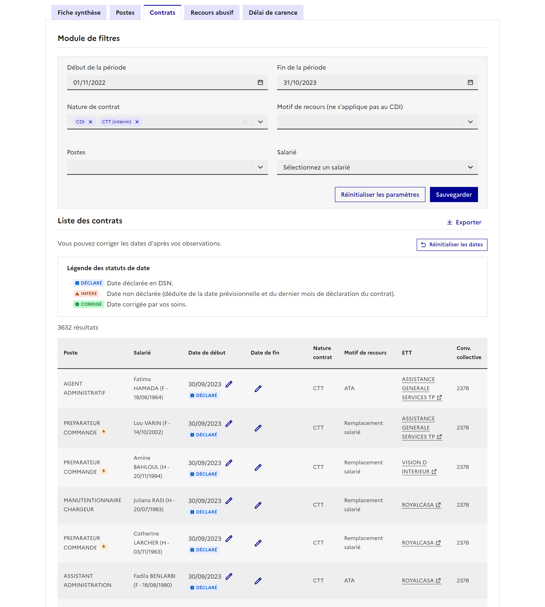

# Front-IT

👉 _See French README [here](documentation/README.md)_

Front-IT is the front-end repository of VisuDSN, the web application dedicated to French Labour Inspection (IT) of the [Champollion project](https://eig.etalab.gouv.fr/defis/champollion/).
This project is developed at the digital direction of French social ministries.

The VisuDSN website aims at facilitating secure access for labor inspectors to data on companies and employees, including fraud detection on precarious contracts. It's an internal tool.

This project is built with [Vite](https://vitejs.dev/), [React](https://fr.reactjs.org/) and TypeScript.
_See other dependencies [here.](documentation/5_dependances.md)📚_

There's a demonstration website [here](https://champollion-front.osc-fr1.scalingo.io/) (with fake data).

- [Front-IT](#front-it)
  - [Documentation](#documentation)
  - [i18n](#i18n)
  - [Main pages](#main-pages)
    - [UI \& Screenshots](#ui--screenshots)
      - [Accessibility](#accessibility)
      - [Home page](#home-page)
      - [Establishment synthesis](#establishment-synthesis)
      - [Establishment jobs](#establishment-jobs)
      - [Establishment contracts](#establishment-contracts)
      - [Abusive use of temporary contracts](#abusive-use-of-temporary-contracts)
      - [Abusive waiting times between contracts](#abusive-waiting-times-between-contracts)
  - [License](#license)

## Documentation

**[See main documentation here.](documentation/)**

## i18n

Since this project is aimed for French public agents, the UI is only in French.
Our original database has tables in french, and we keep the same keywords.

Here are the most used expressions:

- **carences**: waiting time between contracts.
- **contrats**: contracts.
- **CDD** (Contrat à Durée Déterminée): fixed-term contract.
- **CDI** (Contrat à Durée Indéterminée): permanent contract.
- **CTT** (Contrat de Travail Temporaire): temporary employment contract. Unlike a CDD, CTT is employed through an ETT - _see below_, not directly by the company where the employee is working.
- **effectifs**: a company's headcount.
- **entreprise**: a company.
- **etablissement**: a company's establishment. A company can include several establishments (at least one).
- **ETT** (Etablissement de Travail Temporaire): temporary employment agency.
- **indicateur**: a data visualization indicator.
- **poste**: a job or position.
- **recours abusif**: abusive use (of precarious contracts, instead of permanent ones).
- **salarie**: an employee.
- **SIREN**: unique identifier for a French company. Composed of 9 digits.
- **SIRET**: unique identifier for a French establishment, composed of the SIREN code and 5 more digits.

The route names and texts of the app are in French. The documentation intended to run and deploy this project is in French. The rest should be in English.

## Main pages

The website is organized as such:

- Home page with a search bar to find an establishment by SIRET
- Establishment page
  - synthese: summary page
  - postes: list of job titles, possibility to merge similar job titles, and data viz.
  - contrats: list of contracts of the establishment. Only show CDI, CDD and CTT contracts.
  - recours: headcount bar chart to detect abusive use of precarious contracts (CDD and CTT) instead of CDI.
  - carence: compute waiting times between precarious contracts.
- ETT page: list of contracts in temporary work agency.
- Legal pages (terms of use, legal notice, personal data policy)

### UI & Screenshots

Here are a few screenshots of the app (all data displayed is fake).

The UI is based on the French government Design System ([DSFR](https://www.systeme-de-design.gouv.fr/))

#### Accessibility
The DSFR takes into account a11y at its core.
On VisuDSN, all complex dataviz chart can be displayed as tables for accessibility purposes.
The barchart stripes are intended for colorblind people.

#### Home page

#### Establishment synthesis
- Company data

- Open days selection

- Data visualization

#### Establishment jobs
- Filters and dataviz

- Job label merges & automated suggestions

#### Establishment contracts
- Contracts table and filters

- Export modal

#### Abusive use of temporary contracts
- Bar chart

- Table

#### Abusive waiting times between contracts

## License

Front-IT is under Apache-2.0 license.
