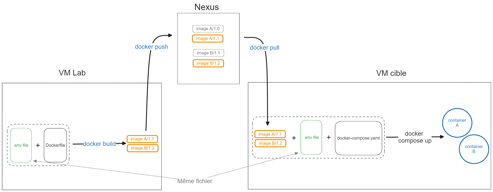

# 1. Déploiement

L'application web Champollion est disponible sur le repository [front-it](..).

> ⚠️ Pour lancer l'application en local voir la documentation sur [l'environnement de développement](2_developpement.md)

1. [Fonctionnement général](#fonctionnement-général)
2. [Préalables](#préalables)
3. [Procédure de build](#build)
4. [Procédure de run](#run)
5. [Rappel rapide de la procédure](#rappel-accéléré)

## Fonctionnement général

La procédure de déploiement consiste à build les images nécessaires au service docker sur la VM qui bénéficie d'une connexion à internet : la VM Lab (OV1-APP-LAB-DEV-003). Puis de déployer ces images sur une VM cible grâce au fichier [docker-compose.yaml](../docker-compose.yaml). Les images sont archivées sur un dépôt Nexus qui permet de transférer une image d'une VM à une autre.



**Si vous modifiez le dockerfile ou que vous souhaitez déployer une nouvelle version du code, vous devez suivre la procédure de build. Sinon suivez uniquement la procédure de run.**

Côté code, pour conserver un historique propre des différents déploiements et de leur contenu, il faut merge les nouveautés à déployer sur main, puis créer l'image à partir de la branche main mise à jour.

## Préalables

Avant de build and run, il convient de réaliser les étapes qui suivent sur les toutes les VM où vous souhaitez build et/ou déployer des images. Ces opérations n'ont besoin d'être réalisées qu'une seule fois par VM.

Côté front, il s'agit de la VM **ovh-web**.

1. Première connexion à la VM

    Sélectionnez `Linux`, acceptez le fingerprint, entrez votre mot de passe. Lors de la 1e connexion, il faut attendre que VS Code se configure, ce sera plus rapide les prochaines fois.
    Pour accéder aux fichiers, cliquer sur `Open Folder` ou bien `Ctrl` + `K`, `Ctrl` + `O` et sélectionnez `/champollion/` pour accéder aux fichiers communs.

2. Loguez vous au Nexus

    Les valeurs pour `NEXUS_USER` et `NEXUS_PASSWORD` se trouvent dans la feuille "login" de l'excel sur l'espace Teams du projet Champollion : **`/Infrasctructure/env/credentials.xlsx`**

    ⚠️ Lors de l'export du mot de passe, les caractères interprétables par bash (!&;'"<>) doivent être précédés d'un backslash. Vérifiez avec `echo $NEXUS_PASSWORD` que la totalité du mdp est bien sauvegardée.

    ```bash
    export NEXUS_USER= # username
    export NEXUS_PASSWORD= # password
    echo $NEXUS_PASSWORD | docker login nexus-ovh.intranet.social.gouv.fr:5000 --username $NEXUS_USER --password-stdin
    ```

3. Ajoutez-vous au groupe docker

    ```bash
    sudo usermod -aG docker $USER
    ```

## Build

> ⚠️ **L'étape de build n'est pas nécessaire si vous n'avez pas modifié le code de l'application que vous souhaitez déployer.** Pour vérifier s'il faut build les images pour lancer le service docker, rendez vous sur [le dépôt Nexus du projet Champollion](https://10.252.1.10/#browse/browse:Champollion:v2%2Fchampollion-dev)\* pour voir les images disponibles.

**Listes des images nécessaires :**

- `front/app`
- `front/reverse-proxy`
- `front/oauth2-proxy`

_\*Le nexus n'est accessible que depuis la PMAD. Continuez sur l'url même si elle n'est pas sécurisée_

1. Créer une merge request (MR) de la branche dev vers la branche main. Cela permet de vérifier les nouveautés à déployer et de revenir en arrière facilement s'il y a un problème. Vous pouvez le faire manuellement ou [cliquer ici](https://gitlab.intranet.social.gouv.fr/champollion/front-it/merge_requests/new?merge_request[source_branch]=dev&merge_request[target_branch]=main).

     > ✅ Bonne pratique : lister les commits déployés dans la description de la MR, trier par feat / fix / chore pour visualiser rapidement ce qui va être déployé.

2. Créez un fichier de variable d'environnement sur la base du [fichier d'exemple](../.env.example) et des variables nécessaires au déploiement. Chaque variable est déclaré au format `MA_VARIABLE_D_ENV=valeur`.

     Les valeurs des variables sont dans la feuille "front" de l'excel sur l'espace Teams du projet Champollion : **`/Développement/environment_variables.xlsx`**. Copiez uniquement les variables nécessaires pour les phases de build et/ou run. Si vous déployez du code nécessitant de nouvelles variables front, ajoutez-les sur l'excel.

     🚨 **Important :** Pensez à mettre à jour la version du tag sur les variables des 3 images pour ne pas écraser les images précédentes et conserver un historique (sauf en cas de correctif : on ne veut pas garder des images qui ne fonctionnent pas).

     > ✅ Bonne pratique : à chaque ajout d'une variable d'environnement dans le fichier .env.local (non versioné sur git car confidentiel), spécifier le nom de la variable dans le fichier .env.example. Ainsi, en créant la MR de dev -> main, on peut visualiser dans la liste des changements s'il y a de nouvelles valeurs dans ce fichier.

3. Merge la branche dev sur main et se mettre à jour sur main en local.

     ```bash
     # cd code/front-it
     git fetch upstream main
     git checkout -B main -t upstream/main
     ```

4. Build et push les images sur les dépôt Nexus

     > ⚠️ **Le build va récupérer le code présent localement, vérifiez que vous êtes sur la bonne branche et le bon commit que vous souhaitez déployer !** Cf étape précédente.

     Placez-vous dans le dossier qui contient le fichier `build.sh` : racine de `front-it/` pour le front. Spécifiez avec l'argument -e le chemin vers le fichier d'environnement que vous venez de créer.

     ```bash
     cd ~/code/front-it
     bash build.sh -p -e <env_file_path>
     ```

     > 💡 L'argument -p permet de push les images. Même si vous déployez le service sur la VM de build (Lab) il est important de push les images build afin de sauvegarder les modifications.<br>

     Pour vérifier que vous avez bien push les images avec les nouveaux tags, rendez vous sur [le dépôt Nexus du projet Champollion](https://10.252.1.10/#browse/browse:Champollion:v2%2Fchampollion-dev)\*

    _\*Le nexus n'est accessible que depuis la PMAD._

## Run

1.  Mettez à jour les fichiers `/champollion/.env` (en copiant le fichier créé pour le build) et `/champollion/docker-compose.yaml` (vérifier s'il y a des modifications dans la MR, copier le fichier `/front-it/docker-compose.yaml`) sur la VM web :

- Pour `/champollion/.env`, copier-coller le fichier de variables d'environnement créé pour le build.
- Pour `/champollion/docker-compose.yaml`, vérifier s'il y a eu des modifications dans la MR dev -> main, copier-coller le fichier local `code/front-it/docker-compose.yaml` le cas échéant.

    > ⚠️ Cette étape n'est pas nécessaire si vous n'avez pas modifié le fichier [docker-compose.yaml](../docker-compose.yaml) et/ou si vous n'avez pas ajouté/retiré de variables d'environnement.

2.  Run les images

     ```bash
     docker compose --env-file /champollion/.env stop && \
     docker compose --env-file /champollion/.env rm -f && \
     docker compose --env-file /champollion/.env up --detach
     ```

     💡 Si vous avez effectué un correctif et buildé une image en gardant le même tag, et donc en surchargeant l'image existante, il faut supprimer localement l'image téléchargée pour aller récupérer la nouvelle image par la suite.

     ```bash
     # arrêter et supprimer les containers
     docker compose --env-file /champollion/.env stop && docker compose --env-file /champollion/.env rm -f
     # récupérer l\'IMAGE ID de l\'image à supprimer
     docker images
     # supprimer l\'image
     docker image rm <image_id>
     # puis relancer la commande de run
     ```

3.  Vérifiez que le statut des containers est "up" avec la commande `docker ps`

## Rappel accéléré

Une fois que vous avez compris le principe et pris l'habitude de déployer, voici un rappel plus concis :

- **MR main**
     - Créer la merge request dev -> main en [cliquant ici](https://gitlab.intranet.social.gouv.fr/champollion/front-it/merge_requests/new?-merge_request[source_branch]=dev&merge_request[target_branch]=main)
     - Ajouter la liste des commits, vérifier qu'il s'agit bien de ce que vous voulez déployer.
     - Vérifier dans la liste des changements si les fichiers `.env.example` et `docker_compose.yaml` ont été modifiés.
     - Merge la MR.
     - Se mettre à jour sur main sur la VM lab.

- **Variables d'env**
     - Ouvrir le fichier Teams `environment_variables` sur l'onglet **front**.
     - Incrémenter les variables de tag des 3 images.
     - Ajouter d'éventuelles nouvelles variables récupérées dans le `.env.example` de la MR.
     - Mettre à jour votre fichier de variables d'environnement sur lab à partir de l'excel.

- **Build sur lab**
     - Lancer la commande de build
     
          ```bash
          cd ~/code/front-it
          bash build.sh -p -e <env_file_path>
          ```
     - Vérifier sur [Nexus](https://10.252.1.10/#browse/browse:Champollion:v2%2Fchampollion-dev) que les images avec le nouveau tag sont bien présentes.

- **Run sur web**
     - Ouvrir la VM web dans une nouvelle fenêtre, en se plaçant bien dans le dossier `/champollion`.
     - Copier-coller le fichier d'env mise à jour sur lab sur `/champollion/.env`
     - S'il y avait des modifications de `docker_compose.yaml` dans la MR, copier-coller depuis la VM lab le fichier `code/front-it/docker-compose.yaml` vers le fichier de la VM web `/champollion/docker-compose.yaml`
     - Lancer la commande de run

     ```bash
     docker compose --env-file /champollion/.env stop && \
     docker compose --env-file /champollion/.env rm -f && \
     docker compose --env-file /champollion/.env up --detach
     # Vérifier que les images sont up
     docker ps
     ```
